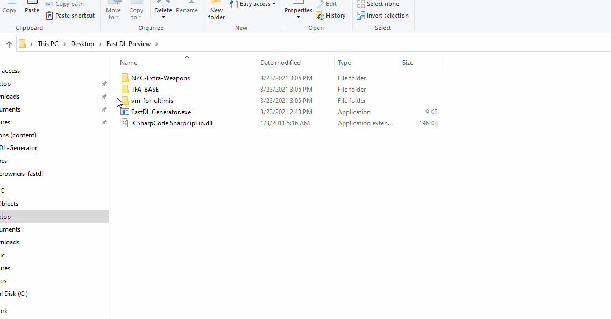

# FastDL-Generator
Generates a Fast DL directory with the lua and compressed files

## How to use
 

     
Windows

     
Drag & drop the directories onto the executable
     

 
 
 

     
Linux

  
  

   
Directly

     
   <code>mono "FastDL Generator.exe" "/home/myaccount/Downloads/an-addon"</code>
  

  

   
With Docker

   <code>docker run -it --rm -v /home/workstation/Downloads:/working ethorbit/fastdl-generator:latest /working/an-addon</code>
  

Make sure there is no forward slash after the path.
 

